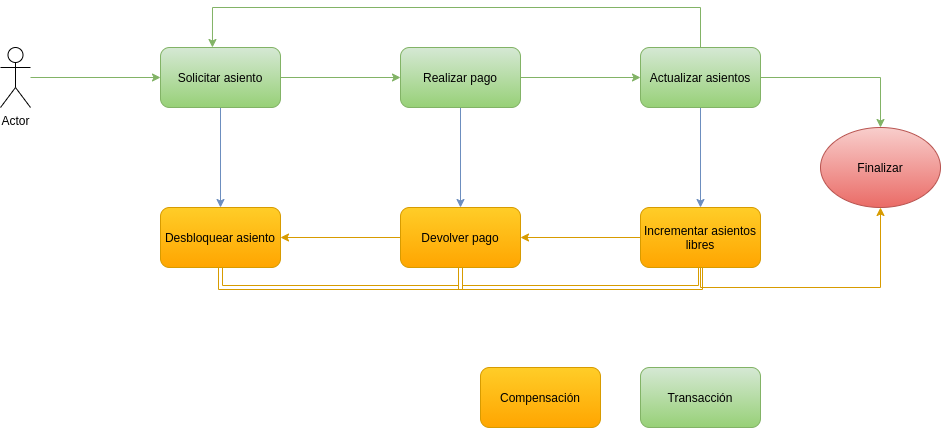
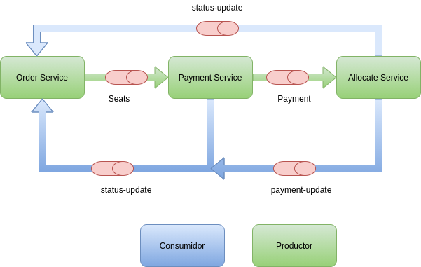

= Saga Pattern example with Quarkus and Kafka =
{localdatetime}
:toc:
:doctype: book
:docinfo:

This project is a simple example about how to make a saga architecture in Quarkus with Apache Kafka and H2 as a database in memory.

If you need more information you can take a look into:

  * Spanish: https://refactorizando.com/patron-saga-quarkus-kafka
  * English: https://refactorizando.com/en/saga-pattern-with-quarkus-and-kafka/

== Introduction

This example about Saga in Quarkus consists of three services, every service works as and independent service and all services together reach a goal. The communication between them is based in event sourcing, which means, that every time a state changes in the microservice, a new event will be triggered and sent to a microservice. 

We can say that a Saga Pattern is a sequence of local transactions, and every transaction update data inside of a single or independect service. 

So we are going to have three microservices, order-service, payment-service and the last one allocate-service.

And every service communicate each other through events using kafka.

== Order Service

https://github.com/refactorizando-web/saga-pattern-example-quarkus-kafka/tree/master/order

This is the entry point in our architecture. This service expect a seat in a json format to start a new transaction to reserve a seat in the cinema. When a user make a new reserve a new procces start 
and the seat is locked, then a status change and a new event will be triggered to make a payment. If every step goes well then a seat will change it status to OCCUPIED.

In the case of something fails, for example you are making a new payment and the client has not enough money in the account, then a compensation will start to restart  seat status. We are going to have three different status: FREE, LOCKED and OCCUPIED. 

 

== Payment Service

https://github.com/refactorizando-web/saga-pattern-example-quarkus-kafka/tree/master/payment

The goal of this service is save a new payment in the database. When a new event from order service is received then create and save a new payment. 

If the payment is saved successfully then a event to change the seat status is sent. In other case a compensation procces start to make a rollback, delete the payment and change to FREE the status seat.

== Allocate Service

https://github.com/refactorizando-web/saga-pattern-example-quarkus-kafka/tree/master/allocate

Allocate service is going to be our last service involved in our architecture. When a payment is saved, then a new event is triggered. Allocate Service processes that event and change the status seat to OCCUPIED and notifies this change to order service.

== More interesting articles

https://refactorizando.com/patron-saga-en-arquitectura-de-microservicios/

https://refactorizando.com/hibernate-panache-quarkus/

https://refactorizando.com/introduccion-arquitectura-event-driven/
